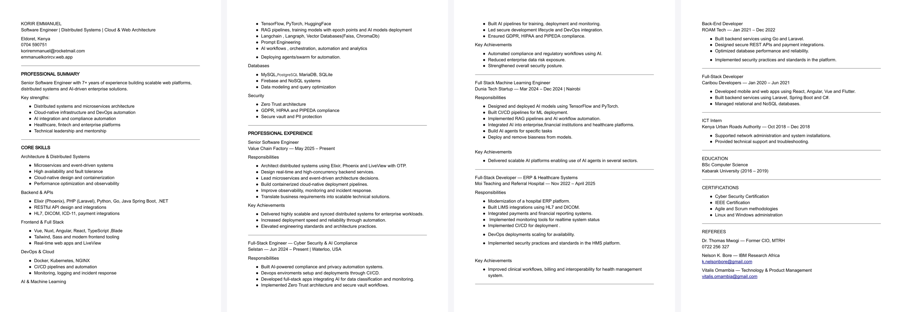

# Emmanuel Korir

**Senior Software Engineer · Distributed Systems · Cloud & AI**
Eldoret, Kenya &middot; <a href="mailto:koriremmanuel@rocketmail.com">koriremmanuel@rocketmail.com</a>

---

## The portfolio site

<table>
  <tr>
    <td align="center" width="33%"> <b>Hero</b> &middot; 3D avatar + Kori the cat</td>
    <td align="center" width="33%"> <b>About</b> &middot; bio + badges</td>
    <td align="center" width="33%"> <b>Things I&rsquo;ve Built</b> &middot; project cards</td>
  </tr>
  <tr>
    <td align="center"> <b>Experience</b> &middot; interactive timeline</td>
    <td align="center"> <b>Blog</b> &middot; reading-time + reader</td>
    <td align="center"> <b>Contact</b> &middot; Firestore-backed form</td>
  </tr>
</table>

> Built with Angular 17 + Three.js + Firebase. AOS scroll animations, real-time admin from the companion app, a 404 page that's a playable mini-game, and Kori &mdash; a Three.js WebGL cat with multi-provider AI chat. [Live site &rarr;](https://emmanuel1017.github.io/Angular-Resume/)

---

## The companion app

<table>
  <tr>
    <td align="center" width="25%"> <b>Welcome</b></td>
    <td align="center" width="25%"> <b>Kori</b> &middot; native chat</td>
    <td align="center" width="25%"> <b>Profile</b></td>
    <td align="center" width="25%"> <b>Admin</b></td>
  </tr>
  <tr>
    <td align="center"> <b>About</b></td>
    <td align="center"> <b>Kori settings</b></td>
    <td align="center"> <b>Messages</b></td>
    <td align="center"> <b>Send</b></td>
  </tr>
</table>

> Flutter app that wraps the portfolio with a native shell &mdash; instant scroll, Firebase-backed inbox with FCM push, a native `CustomPainter` Kori cat (no WebGL on phones), per-conversation chat history, and live admin controls. [Download the APK &rarr;](https://github.com/Emmanuel1017/My-Resume-Flutter-APP/releases/latest/download/portfolio-admin.apk)

---

## CV at a glance

> Click the image for the full PDF, or grab it from the [`cv-latest` release](https://github.com/Emmanuel1017/Angular-Resume/releases/tag/cv-latest). PDF auto-updates from `docs/cv.pdf` via the [Publish CV](https://github.com/Emmanuel1017/Angular-Resume/actions/workflows/cv-release.yml) workflow.

---

## Quick links

| | |
| :--- | :--- |
| **CV (latest, always)** | [Download PDF](https://github.com/Emmanuel1017/Angular-Resume/releases/download/cv-latest/cv.pdf) |
| **Live portfolio** | [emmanuel1017.github.io/Angular-Resume](https://emmanuel1017.github.io/Angular-Resume/) |
| **Companion Android app** | [Latest APK release](https://github.com/Emmanuel1017/My-Resume-Flutter-APP/releases/latest) |
| **Portfolio source** | [Angular-Resume](https://github.com/Emmanuel1017/Angular-Resume) |
| **App source** | [My-Resume-Flutter-APP](https://github.com/Emmanuel1017/My-Resume-Flutter-APP) |
| **Contact** | <koriremmanuel@rocketmail.com> &middot; +254 704 590751 |

---

## The portfolio &mdash; <a href="https://emmanuel1017.github.io/Angular-Resume/">emmanuel1017.github.io/Angular-Resume</a>

A living portfolio site &mdash; not just a CV. Angular 17 + Three.js + Firebase, scroll-triggered animations, real-time admin controls, a blog engine with proper scroll-locked reader, and a 404 page that's a playable canvas game.

**The standout pieces:**

- **Kori, the AI cat** &mdash; a fully-rigged Three.js WebGL character (capsule torso with procedurally-generated tabby fur, sphere head with painted iris textures, spring-physics ears, ~15 named animations). Behind the rig sits a multi-provider chat client that streams from OpenRouter, OpenAI, Claude, Ollama, or runs a quantised model fully in-browser via Transformers.js. Generated images float out of her head as proper thought-bubbles. She's grounded in my CV so she answers recruiter questions truthfully and knows when I'm available for hire.
- **Real-time admin** &mdash; flip availability, close the contact form, change the pinned banner, or kick the whole site into maintenance mode &mdash; all from my phone, all without redeploying. The Angular site listens to one Firestore document and reacts in &lt;1s.
- **404 cube-smash game** &mdash; a fullscreen `<canvas>` mini-game with slow-mo, double-strong cubes, and a spinner threshold. ~1500 lines of plain JS, no game framework. A deliberate easter-egg for anyone who hits a dead link.
- **AOS scroll animations** on every section, a sticky orange "Get the App" banner that drops in 600ms after the hero animates, and an auto-rotating companion-app carousel.

Tech: Angular 17 NgModule hybrid, TypeScript, RxJS, SCSS, Three.js, Hammer.js, AOS, Firebase (Firestore + Remote Config), `angular-cli-ghpages`. `set-env.js` reads `.env` and writes the environment files at build time so secrets stay out of git.

---

## The companion app &mdash; <a href="https://github.com/Emmanuel1017/My-Resume-Flutter-APP">portfolio-admin</a>

Native Flutter app that wraps the portfolio in a full-screen WebView but carves out the screens that should be native:

- **Native Kori chat tab** &mdash; the Three.js cat is hidden inside the WebView (UA marker), replaced with a 2D `CustomPainter` cat (orange tabby palette, blink, tail wag, perspective head turn, boop reaction). Same OpenRouter SSE streaming, same CV-grounded persona, chats persisted locally so they survive tab switches and app restarts.
- **FCM push end-to-end** &mdash; Firestore `onCreate('contacts/{id}')` &rarr; Cloud Function &rarr; multicast to `/admin_tokens` &rarr; foreground heads-up via `flutter_local_notifications` with the app's mint-green accent &rarr; tap deep-links to Messages. Token persistence driven by the auth stream so cold-start race conditions don't drop registrations.
- **Paginated inbox** with cached sort keys, `ValueNotifier`-driven expansion (only affected cards rebuild), per-row `RepaintBoundary`s, windowed display, pull-to-refresh.
- **Admin Insights &rarr; Visits** &mdash; every page load on the public site writes a `/visits` row via `ipapi.co` (IP, city, country, ISP, ASN, UA, screen). Three `fl_chart` charts (daily bar, source donut, top-5 countries).
- **Floating rounded bottom nav**, Caribou-Devs launcher icon, R8 full-mode shrunk APK at ~54 MB on `arm64-v8a + armeabi-v7a`.

Available on Android (live), Windows portable, Linux tarball, iOS via TestFlight. Install commands per OS in the repo README.

---

## Core technologies

**Architecture** &mdash; Microservices, event-driven systems, high availability, cloud-native design, observability.
**Backend** &mdash; Elixir/Phoenix/OTP (primary), Laravel/PHP, Python, Go, Java Spring Boot, .NET. REST + LiveView + healthcare interop (HL7, DICOM, ICD-11) + payment integrations.
**Frontend** &mdash; Angular, Vue/Nuxt, React, TypeScript, Tailwind, SCSS, Blade. Real-time web.
**DevOps** &mdash; Docker, Kubernetes, NGINX, CI/CD, monitoring, incident response.
**AI/ML** &mdash; TensorFlow, PyTorch, HuggingFace, RAG pipelines, LangChain, LangGraph, Faiss, ChromaDB, prompt engineering, agent swarms, model deployment + bias removal.
**Security** &mdash; Zero Trust, GDPR/HIPAA/PIPEDA compliance, secure vaults, PII protection.
**Data** &mdash; MySQL, PostgreSQL, MariaDB, SQLite, Firebase, NoSQL.

---

## Where I've worked

| When | Role | Where |
| --- | --- | --- |
| May 2025 &rarr; now | Senior Software Engineer | Value Chain Factory |
| Jun 2024 &rarr; now | Full-Stack Engineer (Cyber Security & AI Compliance) | Selstan, Waterloo USA |
| Mar &ndash; Dec 2024 | Full-Stack ML Engineer | Dunia Tech, Nairobi |
| Nov 2022 &ndash; Apr 2025 | Full-Stack Dev (ERP & Healthcare) | Moi Teaching & Referral Hospital |
| Jan 2021 &ndash; Dec 2022 | Back-End Developer | ROAM Tech |
| Jan 2020 &ndash; Jun 2021 | Full-Stack Developer | Caribou Developers |

Education: BSc Computer Science &mdash; Kabarak University (2016&ndash;2019).
Certs: Cyber Security &middot; IEEE &middot; Agile/Scrum &middot; Linux & Windows administration.

---

## GitHub

  
  

  

---

## Open to work?

Live status: **<a href="https://emmanuel1017.github.io/Angular-Resume/#contact">check the badge on the portfolio</a>** &mdash; wired to a Firestore flag I toggle from the companion app. Always interested in a good conversation about senior software engineering work &mdash; full-time, contract, or consulting. <koriremmanuel@rocketmail.com>.

> Good software is not just functional. It is reliable, secure, and built to evolve.
